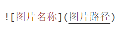

# Markdown 语法
## 标题：
“#” 表示一级标题，“##” 表示二级标题，以此类推。

## 字体：
**Hello World!**      (在字体左右两边各加上**，表示加粗。)

*Hello World!*        (在字体左右两边各加上*，表示斜体。)

***Hello World!***     (在字体左右两边各加上***，表示斜体加粗。)

~~Hello World!~~       (在字体左右两边各加上~~，表示删除线。)

## 引用：
> 在字体左边加上>，表示引用。

## 分割线：

---    (在一行中输入三个减号，即可表示分割线。)
---

***    (在一行中输入三个星号，即可表示分割线。)
***

## 图片：
  

> ↑添加图片格式示例 

## 超链接：
[点击跳转到m1ng-wym主页](https://github.com/m1ng-wym)
 

