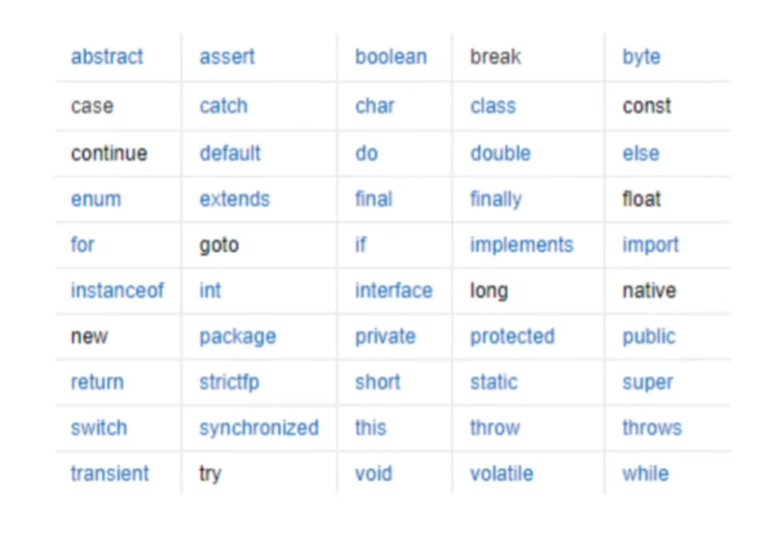

# 标识符和关键字
类名、变量名、方法名都被称为标识符。

- 所有的标识符都应该以字母（A-Z 或者 a-z）、美元符（$）、或者下划线（_）开始
- 首字符之后可以是字母（A-Z 或者 a-z）、美元符（$）、下划线（_）或数字的任何字符组合
- 不能使用关键字作为变量名或方法名
- 标识符是大小写敏感的
- 合法标识符举例：age、$salary、_value、__1_value
- 非法标识符举例：123abc、-salary、#abc

***

> ↑↑关键字