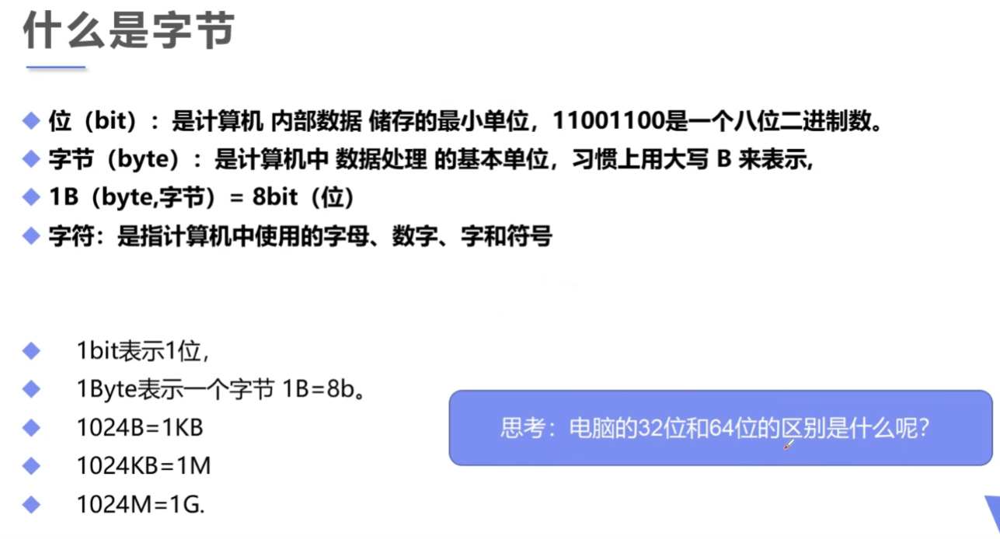

# 数据类型
> Java是一种强类型语言，要求变量的使用要严格符合规定，所有变量都必须先定义后才能使用。
- 强类型语言：安全性高，速度慢。
- 弱类型语言


```java
public class Demo {
    public static void main(String[] args) {        
        // 八大基本数据类型 
        // 整数
        int num1 = 10;  //最常用
        byte num2 = 20;
        short num3 = 30;
        long num4 = 30L;  //Long类型要在数字后面加个L

        // 小数：浮点数
        float num5 = 50.1f;  //float类型要在数字后面加个f (f或F都可以)
        double num6 = 3.141592653589793238462643;

        // 字符
        char name1 = '俺';
        char name2 = '不';
        char name3 = '中';
        char name4 = '嘞';

        // 字符串，String不是关键字，是类。
        // String name5 = "俺不中嘞";

        // 布尔值：是非
        boolean flag1 = true;
        boolean flag2 = false;   
    }
}
```

## 变量
> 变量就是可以变化的量。
> Java变量是程序中最基本的存储单元，其要素包括变量名、变量类型和作用域。

```java
type varName [=value] [{,varName[=value]}] ;
//数据类型 变量名 = 值;  可以使用逗号隔开来声明多个同类型变量。
```

***

### 拓展：什么是字节



***